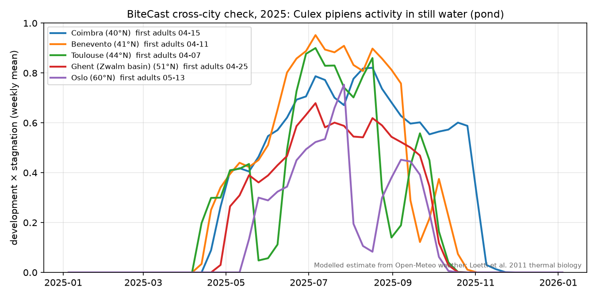
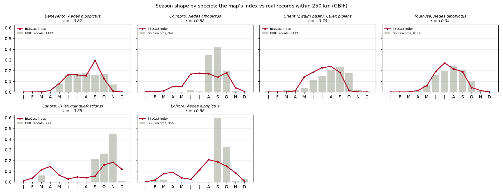

# BiteCast

IEEE OneAquaHealth Global Hackathon 2026, **Track 6** (also Tracks 3 and 7).

BiteCast shows which ditches, drains, ponds and neighbourhoods in a town are breeding biting mosquitoes
tonight, and why. Search any town (or zoom into its streets), and every patch of water on the map is
coloured by mosquito risk. Tap one and you get the score, the reason behind it in plain words, and what
to do about it.

It is a modelled estimate, not a field measurement. There is no trained model: every number comes from
published lab data, the weather, and open maps, and can be checked against its source.

## Why water

Mosquitoes that carry West Nile virus and dengue breed in still water. A stream that keeps flowing
flushes their larvae out; the same stream silted up, or a blocked drain, a stormwater basin or a bucket in a
back yard, lets them grow. So the condition of a town's water decides where people get bitten, and that
link is what the OneAquaHealth project studies in urban streams. BiteCast turns it into a map anyone can
read, and a data feed a health department can use.

## How the score works

Each spot gets a score from 0 to 100, four factors multiplied together, so the weakest one caps it:

| Factor | What it is | Source |
|---|---|---|
| Mosquito growth | Warmth banked by the larvae, day by day, until adults emerge | Lab development curves for each species (below) and daily temperature |
| Still water | Days since rain last flushed the larvae out | Daily rainfall; small channels flush at 10 mm a day, ponds at 25 mm |
| Water type | How likely this water is to stand still | OpenStreetMap tags (ditch, drain, pond, basin, stream...) and satellite water |
| People nearby | Homes, schools, parks and playgrounds within 300 m, or people counted by satellite | OpenStreetMap, Meta's population map |

Where winters are cold, the season ends when days drop below 12 hours and the weekly mean below 15 °C,
because new females then overwinter instead of biting (Field et al. 2022).

**Which mosquito.** Each place gets the species that actually live there: those recorded within 250 km
in GBIF, or those the local winter allows where the area has too few records to rule them out.

| Species | Breeds in | Development data |
|---|---|---|
| *Culex pipiens* (northern house mosquito, West Nile) | drains, ditches, ponds | Loetti, Schweigmann & Burroni 2011: 5.5 °C threshold, 199.5 degree-days from first-instar larva to adult, Brière limits 9.8–34.2 °C (females) |
| *Culex quinquefasciatus* (southern house mosquito) | the same, no winter pause | Shocket et al. 2020, eLife |
| *Aedes aegypti* (dengue mosquito) | buckets, tanks, tyres around homes | Mordecai et al. 2017, PLoS NTD |
| *Aedes albopictus* (tiger mosquito) | the same | Mordecai et al. 2017 |

No map shows buckets, so the container breeders are drawn on the neighbourhoods where people live, with
rain filling the containers and evaporation emptying them.

Every coefficient, where it comes from and how sure we are of it is in [docs/SCIENCE.md](docs/SCIENCE.md).

## Does it behave like real mosquitoes?

Two checks run on every change (`python check.py`):

- **Across latitude.** The season should start later and run weaker further north. Oslo's season totals
  under half of Coimbra's and starts weeks later.
  
- **Against real records.** The modelled season is compared, month by month, with real mosquito records
  from GBIF near each place. Where there are enough records the seasons correlate at r = 0.72 on average;
  real populations peak a few weeks after the model, because the model tracks breeding conditions and
  populations take a few generations to build up.
  

Bite reports from people using the app are compared with what the model predicted for that spot and
night, and the tally is shown on the map.

## Data

All free, no account needed at run time:

- **Weather:** [Open-Meteo](https://open-meteo.com/) (history and 16-day forecast). If its free daily
  allowance runs out, past weather for a new place comes from [NASA POWER](https://power.larc.nasa.gov/),
  adjusted to Open-Meteo's recent days.
- **Water and places:** [OpenStreetMap](https://www.openstreetmap.org/) via the public Overpass servers.
- **Water nobody has mapped:** [JRC Global Surface Water](https://global-surface-water.appspot.com/)
  (Pekel et al. 2016), which also says how many months a year each patch holds water.
- **People:** Meta's [High Resolution Settlement Layer](https://dataforgood.facebook.com/dfg/tools/high-resolution-population-density-maps).
- **Mosquito records:** [GBIF](https://www.gbif.org/).
- **City list for pre-loading:** [GeoNames](https://www.geonames.org/). **Place search:** [Photon](https://photon.komoot.io/).
- **Basemap:** [OpenFreeMap](https://openfreemap.org/), © OpenMapTiles, © OpenStreetMap contributors.

A place is fetched the first time someone opens it and cached after that. About 140 cities, including the
five OneAquaHealth study sites (Benevento, Coimbra, Ghent, Oslo, Toulouse), are pre-loaded in `data/`.

## For health systems: FHIR

Each forecast can be exported as a FHIR R4 Bundle: a `Location` for the water (or neighbourhood) and an
`Observation` for the risk on a given day, with each factor as a component. There is no LOINC code for
mosquito breeding risk, so the code is local and clearly namespaced. Details and the reasoning behind each
choice: [fhir/README.md](fhir/README.md).

`GET /api/cities/coimbra/fhir?limit=20` returns the 20 riskiest spots in Coimbra today.

## Run it

Python 3.13.

```bash
pip install -r requirements.txt
uvicorn api:app --port 8000
```

Then open http://localhost:8000. The API is documented at `/docs`.

- `python check.py` runs every self-check and an API test across all cached places.
- `python preload.py --top 40` pre-loads the next 40 biggest cities not cached yet.
- `python sat.py` fetches the satellite layers for any cached place that lacks them.

Bite reports are stored in Postgres when `DATABASE_URL` is set (we use [Neon](https://neon.tech/)), and in a
local SQLite file otherwise. Put `DATABASE_URL=...` in a `.env` file or the environment; `.env` is ignored
by git.

**Deploying.** `render.yaml` runs the app on Render's free tier. A weekly GitHub Action
(`.github/workflows/data.yml`) refreshes the weather for every cached place, pre-loads more cities and
commits the data, so nothing depends on anyone's computer being on.

## Layout

```
api.py            HTTP API and the web app (app/)
model/            degree days, stagnation, habitat and exposure, species, containers, risk
fetch.py          weather and OpenStreetMap downloads
sat.py            satellite water and population layers
places.py         any point on earth: fetch once, cache, keep fresh (refresh.py)
presence.py       GBIF records per place
feedback.py       bite reports; treatments.py larvicide log for control teams
fhir/             FHIR R4 export
validate*.py      the cross-city and GBIF checks
app/              the web app (MapLibre, no build step)
data/             cached weather, maps, satellite layers and species records
```

## Limits

- Air temperature stands in for water temperature, and flushing is all-or-nothing.
- The development rates come from lab populations at constant temperatures.
- Container breeders are drawn on neighbourhoods, because the containers themselves are not mapped.
- OpenStreetMap coverage varies a lot. Satellites fill in open water larger than about 0.4 ha and
  settlements, but not ditches and drains; small towns in parts of Africa, South America and South Asia
  can look emptier than they are.
- The index tracks breeding conditions, not mosquito numbers. Real populations peak a few weeks later.
- A new place can take up to a minute to load the first time, because the public map servers are slow.
- *Anopheles* (malaria) is not modelled.

## Licence

MIT. Data sources keep their own licences (ODbL for OpenStreetMap, CC BY 4.0 for GeoNames, JRC and Meta
data, and the terms of Open-Meteo and GBIF).
